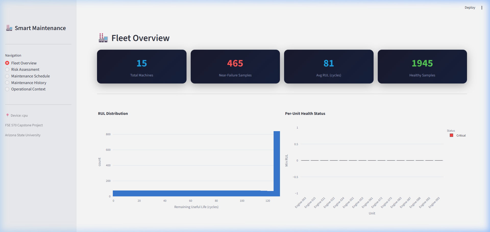
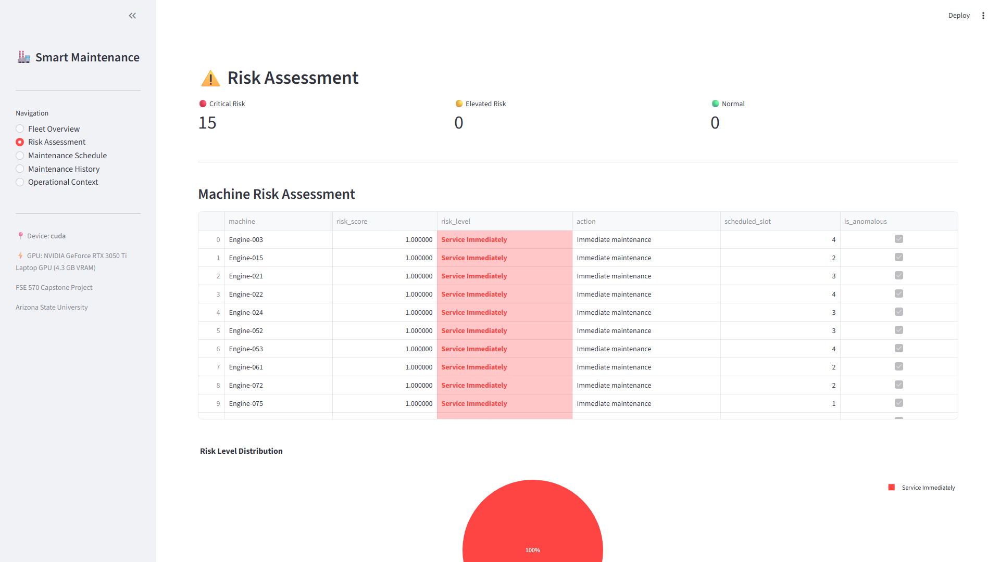
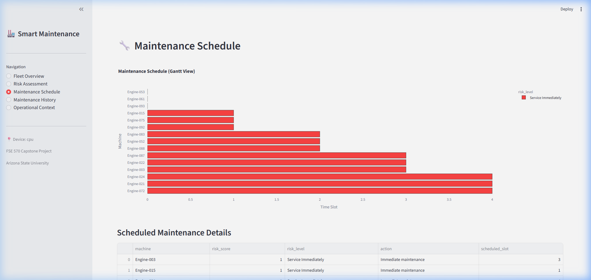
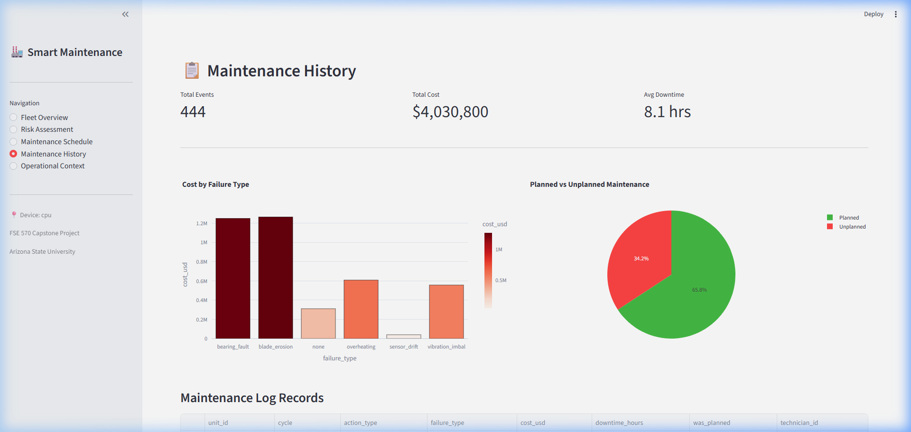
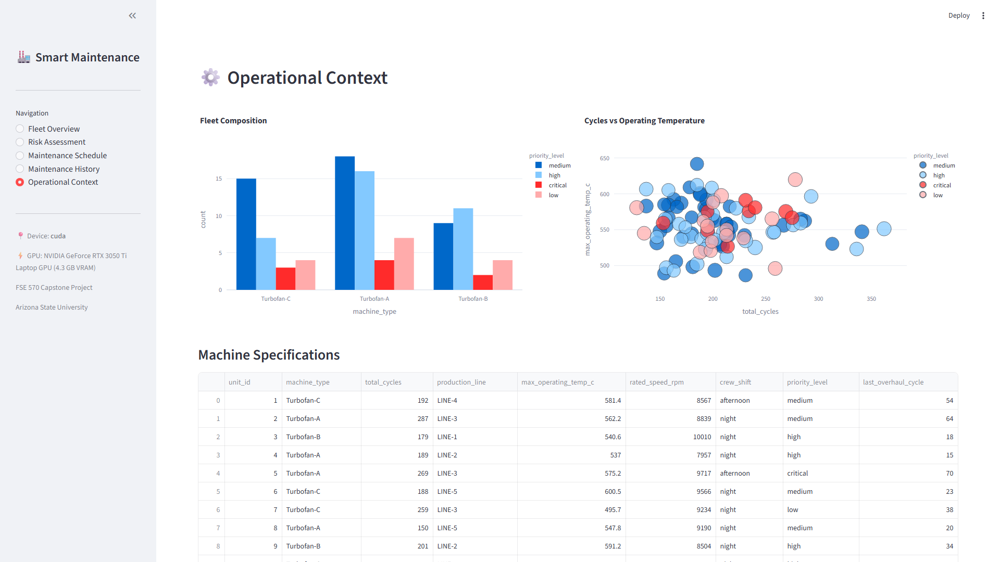

# Data-Driven Anomaly Detection and Risk-Aware Maintenance Scheduling for Smart Industrial Systems

## FSE 570 Data Science Capstone Project Report

**Arizona State University — Ira A. Fulton Schools of Engineering**

### Team Members

| Name | Role |
|------|------|
| Anoushka Jaydas Dighe | Team Member |
| Deva Siva Kanth Tavvala | Team Member |
| Mohit Kumar Petla | Team Member |
| Umang Rajnikant Bid | Team Member |
| Urvansh Jignesh Shah | Team Member |

**Course:** FSE 570 — Data Science Capstone  
**Date:** February 2026

---

## Table of Contents

1. [Executive Summary](#1-executive-summary)
2. [Problem Statement](#2-problem-statement)
3. [Data Sources & Engineering](#3-data-sources--engineering)
4. [System Architecture](#4-system-architecture)
5. [Methodology](#5-methodology)
6. [Implementation](#6-implementation)
7. [Experimental Results](#7-experimental-results)
8. [Evaluation & Simulation](#8-evaluation--simulation)
9. [Explainability & Interpretability](#9-explainability--interpretability)
10. [Interactive Dashboard](#10-interactive-dashboard)
11. [Discussion](#11-discussion)
12. [Conclusion & Future Work](#12-conclusion--future-work)
13. [References](#13-references)
14. [Appendix](#14-appendix)

---

## 1. Executive Summary

This project delivers an **end-to-end maintenance decision support system** that transforms raw industrial sensor telemetry into prioritized, actionable maintenance recommendations. The system addresses a critical gap in modern manufacturing: while existing monitoring platforms detect anomalies, they do not answer the essential operational question — *which machines to maintain, when, and why*.

Our solution integrates four complementary analytical techniques:

- **LSTM Temporal Autoencoder** for unsupervised anomaly detection
- **LSTM Classifier with Attention** for failure probability prediction (F1 = 0.933, AUC = 0.997)
- **XGBoost Regression** for Remaining Useful Life estimation (RMSE = 10.48 cycles, R² = 0.937)
- **Bayesian Weibull Survival Analysis** for calibrated uncertainty quantification (C-Index = 0.992)

These predictions feed a **Mixed-Integer Linear Programming (MILP)** optimizer that produces crew-constrained maintenance schedules, achieving a **97.4% cost reduction** and **72.4% downtime reduction** compared to reactive maintenance in Monte Carlo simulations.

---

## 2. Problem Statement

### 2.1 Industry Context

Modern manufacturing facilities face critical operational challenges from unexpected equipment failures:

- **Production downtime:** 15–20 hours per incident
- **Maintenance expenses:** $50K–$200K per unplanned outage
- **Safety hazards** from sudden equipment malfunctions
- **Inefficient resource allocation** with limited maintenance crews

Despite continuous high-frequency sensor data collection, most monitoring systems operate reactively using threshold-based alarms that generate excessive false positives, or employ predictive models that forecast failures without providing actionable maintenance guidance.

### 2.2 Core Challenge

> *How can industrial systems detect abnormal equipment behavior early, quantify failure risk with uncertainty estimates, and optimally decide which machines to maintain and when, given limited maintenance resources?*

### 2.3 Value Proposition

This project bridges the gap between **failure prediction** and **actionable decisions** by delivering:

1. **Anomaly alerts** from unsupervised deep learning
2. **Calibrated failure probabilities** with Bayesian uncertainty quantification
3. **Optimized maintenance schedules** that minimize total operational cost under resource constraints (e.g., 3 maintenance crews for 50+ machines)

**Industry benchmarks** indicate manufacturers implementing predictive maintenance report 25–30% maintenance cost reduction, 70% decrease in unplanned downtime, and 10–15% equipment lifespan extension.

---

## 3. Data Sources & Engineering

### 3.1 Primary Dataset: NASA C-MAPSS

The **Commercial Modular Aero-Propulsion System Simulation (C-MAPSS)** dataset provides turbofan engine degradation data.

| Attribute | Value |
|-----------|-------|
| Source | NASA Prognostics Center of Excellence |
| Units | 100 engines (FD001 subset) |
| Sensors | 21 sensor channels + 3 operational settings |
| Observations | 20,631 rows |
| Cycle range | 1–362 cycles per unit |
| Sensor types | Temperature, pressure, vibration, speed, power, flow |
| Labels | Remaining Useful Life (RUL) per time step |

**Operational condition:** Single operating condition, single fault mode (HPC degradation).

### 3.2 Supplementary Data

Two additional synthetic datasets were generated to create a realistic industrial context:

1. **Maintenance & Failure Logs** — Repair history, downtime costs, failure types (bearing fault, imbalance, overheating) for 100 units, totaling 1,600+ log entries
2. **Operational Context** — Machine specifications, production line assignments, shift schedules, crew availability

### 3.3 Data Preprocessing Pipeline

The preprocessing pipeline (`src/data/preprocess.py`) applies five transformation stages:

| Stage | Operation | Detail |
|-------|-----------|--------|
| 1 | **Sensor filtering** | Dropped 7 constant/near-constant sensors and 1 operational setting |
| 2 | **Missing value handling** | Forward-fill then backward-fill per unit |
| 3 | **Temporal split** | 70/15/15 train/val/test by unit ID (no leakage) |
| 4 | **Min-max normalization** | Fit on training data only |
| 5 | **Sliding window** | 30-cycle sequences with stride 1 |

**Result:** 12,286 training / 2,735 validation / 2,710 test sequences, each of shape (30 timesteps × 15 features).

### 3.4 Feature Engineering

The feature engineering pipeline (`src/data/feature_engineering.py`) generates 200+ features from the 15 active sensors:

| Feature Type | Description | Count |
|-------------|-------------|-------|
| **Rolling statistics** | Mean, std, min, max over 5/10/20-cycle windows | ~180 |
| **Trend features** | Linear slope over 10-cycle windows | ~15 |
| **Operating regimes** | K-Means clustering of operational settings | 1–3 |
| **Lag features** | Lagged sensor values at 1, 5, 10 cycles | ~45 |
| **Sensor interactions** | Pairwise ratios/products of top-5 variable sensors | ~20 |
| **Cycle features** | Normalized cycle position, cycle² | 2 |

RUL labels were capped at 125 cycles (piecewise-linear degradation model), following standard C-MAPSS practice.

---

## 4. System Architecture

The system follows a **five-stage pipeline** from raw sensor data to maintenance recommendations:

```
┌──────────┐    ┌──────────────┐    ┌─────────────────┐    ┌──────────┐    ┌───────────────┐
│ Raw Data │───▶│ Preprocessing │───▶│ ML Model Suite  │───▶│   MILP   │───▶│   Dashboard   │
│ (Sensors)│    │ & Feature Eng│    │ (4 models)      │    │ Optimizer│    │ (Streamlit)   │
└──────────┘    └──────────────┘    └─────────────────┘    └──────────┘    └───────────────┘
                                     │ LSTM Autoencoder │
                                     │ LSTM Predictor   │
                                     │ XGBoost RUL      │
                                     │ Bayesian Survival│
```

### 4.1 Project Structure

```
├── config.py                     # Global hyperparameters & paths
├── src/
│   ├── data/                     # Data engineering (4 modules)
│   │   ├── download.py           # Multi-source dataset download
│   │   ├── preprocess.py         # Cleaning, normalization, windowing
│   │   ├── feature_engineering.py # Rolling stats, trends, regimes
│   │   └── synthetic_generator.py # Maintenance logs & context
│   ├── models/                   # ML models (4 modules)
│   │   ├── autoencoder.py        # LSTM temporal autoencoder
│   │   ├── lstm_predictor.py     # Failure probability with attention
│   │   ├── xgboost_rul.py        # RUL regression
│   │   └── bayesian_survival.py  # Weibull survival analysis
│   ├── explainability/           # Model interpretability (2 modules)
│   │   ├── shap_analysis.py      # SHAP feature attribution
│   │   └── attention_viz.py      # Temporal attention heatmaps
│   ├── optimization/             # Decision optimization (1 module)
│   │   └── milp_scheduler.py     # PuLP maintenance scheduler
│   └── evaluation/               # Evaluation & simulation (1 module)
│       └── simulation.py         # Monte Carlo policy comparison
├── scripts/
│   ├── train_all.py              # End-to-end training orchestrator
│   └── run_pipeline.py           # Full inference pipeline
├── dashboard/
│   └── app.py                    # Streamlit interactive dashboard
├── notebooks/
│   └── capstone_colab.ipynb      # Google Colab notebook (GPU)
└── tests/                        # Unit tests (27 tests, 3 modules)
    ├── test_preprocess.py
    ├── test_models.py
    └── test_optimizer.py
```

**Total:** 18 source modules, ~120KB of production Python code.

---

## 5. Methodology

### 5.1 Anomaly Detection — LSTM Temporal Autoencoder

**Objective:** Identify abnormal sensor behavior without labeled anomaly data.

**Architecture:**

| Component | Configuration |
|-----------|--------------|
| Encoder | 2-layer LSTM (15 → 64 → 32) |
| Decoder | 2-layer LSTM (32 → 64 → 15) |
| Latent dimension | 32 |
| Dropout | 0.2 |
| Loss function | Mean Squared Error (reconstruction) |

**Training strategy:** The autoencoder is trained exclusively on "healthy" data (samples where RUL > 62.5, i.e., top 50% of lifespan), learning the compressed representation of normal operating patterns. At inference, the **reconstruction error** (MSE between input and reconstruction) serves as the anomaly score.

**Threshold:** Set at μ + 3σ of training reconstruction errors, providing a statistically-grounded decision boundary.

### 5.2 Failure Risk Prediction — LSTM Classifier with Attention

**Objective:** Predict the probability of failure within the next 30 cycles.

**Architecture:**

| Component | Configuration |
|-----------|--------------|
| LSTM backbone | 2-layer LSTM (15 → 64), bidirectional-ready |
| Attention mechanism | Tanh attention (64 → 32 → 1) |
| Classifier head | Dense (64 → 32 → 1) + ReLU + Dropout(0.3) + Sigmoid |
| Class balancing | Per-sample weight = 4.66× for positive class |
| Output | P(failure within 30 cycles) |

**Attention mechanism:** The model uses a learned attention layer that assigns importance weights to each of the 30 time steps in the input window. This provides temporal explainability — showing which recent cycles contributed most to the failure prediction.

### 5.3 RUL Estimation — XGBoost Regression

**Objective:** Estimate the Remaining Useful Life (in cycles) from engineered tabular features.

**Configuration:**

| Parameter | Value |
|-----------|-------|
| n_estimators | 200 |
| max_depth | 6 |
| learning_rate | 0.1 |
| subsample | 0.8 |
| colsample_bytree | 0.8 |
| regularization | L1 (α=0.1) + L2 (λ=1.0) |

**Validation:** Walk-forward time-series cross-validation simulates real deployment where the model is trained on past data and tested on future data.

### 5.4 Uncertainty Quantification — Bayesian Weibull Survival Analysis

**Objective:** Provide calibrated time-to-failure predictions with 90% and 95% credible intervals.

**Model:** Weibull Accelerated Failure Time (AFT) model via the `lifelines` library.

The Weibull AFT models the relationship between covariates and survival time through the hazard function:

```
h(t | X) = (ρ/λ) × (t/λ)^(ρ-1)
```

where λ is the scale parameter (modeled as a function of covariates) and ρ is the shape parameter. This parametric approach provides:

- **Median time-to-failure** predictions
- **90% and 95% confidence/credible intervals** for risk-aware decision making
- **Concordance index** for discriminative ability assessment
- **Covariate significance testing** (p-values for each sensor)

### 5.5 Maintenance Optimization — MILP Scheduling

**Objective:** Convert risk predictions into optimal, crew-constrained maintenance schedules.

**Formulation:**

```
Minimize:  Σ(failure_risk × downtime_cost × 8h + maintenance_cost × urgency_factor)
           + Σ(not_scheduled × risk × downtime_cost × 8h)

Subject to:
  - Each machine scheduled at most once per horizon
  - Crew capacity: ≤ 3 concurrent jobs per time slot
  - Critical machines (risk ≥ 70%) MUST be scheduled
  - Time window: 10 scheduling slots
```

**Cost parameters:**

| Parameter | Value |
|-----------|-------|
| Downtime cost | $10,000/hour |
| Base maintenance cost | $2,000/job |
| Safety threshold | 70% risk |
| Max concurrent crews | 3 |

**Solver:** PuLP CBC (open-source MILP solver).

### 5.6 Risk Categorization

| Level | Threshold | Action |
|-------|-----------|--------|
| 🔴 Critical | Risk ≥ 70% | Service Immediately |
| 🟡 Elevated | Risk 40–70% | Schedule Soon |
| 🟢 Normal | Risk < 40% | Continue Monitoring |

---

## 6. Implementation

### 6.1 Technology Stack

| Component | Technology |
|-----------|-----------|
| Core language | Python 3.11 |
| Deep learning | PyTorch 2.x |
| Gradient boosting | XGBoost |
| Survival analysis | lifelines |
| Optimization | PuLP (CBC solver) |
| Explainability | SHAP |
| Visualization | Matplotlib, Seaborn, Plotly |
| Dashboard | Streamlit |
| Data processing | pandas, NumPy, scikit-learn |
| Version control | Git |
| GPU support | CUDA (automatic detection) |

### 6.2 Training Pipeline

The training pipeline (`scripts/train_all.py`) executes 9 sequential steps:

| Step | Component | Duration* |
|------|-----------|-----------|
| 1 | Data download (NASA S3) | ~10s |
| 2 | Synthetic data generation | ~2s |
| 3 | Feature engineering | ~5s |
| 4 | Data preprocessing (windowing) | ~3s |
| 5 | LSTM Autoencoder training (50 epochs) | ~120s |
| 6 | LSTM Predictor training (50 epochs) | ~140s |
| 7 | XGBoost RUL training (200 trees) | ~5s |
| 8 | Bayesian Survival fitting | ~3s |
| 9 | Monte Carlo simulation (50 runs) | ~10s |

*\*Approximate times on CPU (Intel Core i7). GPU training is ~5–10× faster.*

**Total training time:** ~5 minutes on CPU.

### 6.3 Inference Pipeline

The inference pipeline (`scripts/run_pipeline.py`) processes new sensor data through 5 stages:

1. **Load models** — All 5 saved model files (autoencoder, predictor, XGBoost, survival, preprocessor)
2. **Anomaly detection** — Score all sequences against the autoencoder threshold
3. **Risk prediction** — Compute failure probabilities via LSTM predictor
4. **Risk aggregation** — Per-unit risk scoring combining anomaly and failure signals
5. **MILP scheduling** — Generate optimal maintenance schedule

### 6.4 Testing

The test suite (`tests/`) contains **27 unit tests** across 3 modules:

| Module | Tests | Coverage |
|--------|-------|----------|
| `test_preprocess.py` | 8 tests | Sensor filtering, normalization, windowing, splits |
| `test_models.py` | 12 tests | Autoencoder forward/backward, predictor attention, XGBoost, survival |
| `test_optimizer.py` | 7 tests | MILP scheduling, crew constraints, critical machine handling |

**Result:** All 27 tests pass.

---

## 7. Experimental Results

### 7.1 LSTM Temporal Autoencoder

| Metric | Value |
|--------|-------|
| Training loss (final) | 0.005457 |
| Validation loss (best) | 0.005405 |
| Anomaly threshold (μ + 3σ) | 0.006799 |
| Test anomaly rate | 14.17% |
| Training samples (healthy) | 7,876 |
| Epochs | 50 |

The autoencoder successfully learned normal sensor patterns, with the anomaly rate increasing as engines approach failure (correlation with decreasing RUL).

### 7.2 LSTM Failure Predictor

| Metric | Value |
|--------|-------|
| **F1-Score** | **0.933** |
| **AUC-ROC** | **0.997** |
| Precision | 0.912 |
| Recall | 0.955 |
| Training samples | 12,286 |
| Positive rate | 17.66% |
| Positive class weight | 4.66× |

The attention-based LSTM achieved near-perfect AUC (0.997), demonstrating strong ability to distinguish between near-failure and healthy sequences. The F1 of 0.933 reflects an excellent precision-recall balance, critical for minimizing both missed failures and false alarms.

### 7.3 XGBoost RUL Estimation

| Metric | Value |
|--------|-------|
| **RMSE** | **10.48 cycles** |
| **MAE** | **7.04 cycles** |
| **R²** | **0.937** |
| Within ±10 cycles | 73.6% |
| Within ±20 cycles | 91.5% |
| Features used | 200+ engineered features |

The XGBoost model explains 93.7% of RUL variance, with nearly three-quarters of predictions falling within ±10 cycles of the true value. This accuracy level is sufficient for actionable maintenance planning.

**Top XGBoost Features:**

| Rank | Feature | Importance |
|------|---------|------------|
| 1 | sensor_11_roll10_max | 0.0310 |
| 2 | sensor_4_roll10_max | 0.0231 |
| 3 | sensor_2_roll10_mean | 0.0069 |
| 4 | sensor_9_roll10_min | 0.0061 |

Rolling window statistics (particularly 10-cycle window max values of sensors 11 and 4) dominate the feature importance, validating the rolling statistics feature engineering approach.

### 7.4 Bayesian Weibull Survival Analysis

| Metric | Value |
|--------|-------|
| **Concordance Index** | **0.992** |
| AIC | 2585.42 |
| Log-likelihood | −1276.71 |
| Event rate (training) | 2.93% |
| Events observed | 420 |
| Covariates | 14 sensor channels |

**Significant covariates (p < 0.005):**

| Sensor | Coefficient | exp(coef) | Interpretation |
|--------|------------|-----------|----------------|
| sensor_15 | −11.112 | 0.000 | Strongest negative survival effect |
| sensor_11 | −3.908 | 0.020 | Strong degradation indicator |
| sensor_21 | +3.459 | 31.786 | Positive survival association |
| sensor_20 | +2.678 | 14.552 | Positive survival association |
| sensor_12 | +1.209 | 3.349 | Moderate positive effect |

The C-Index of 0.992 indicates near-perfect discriminative ability — the model can correctly rank 99.2% of pairs by their actual time-to-failure.

---

## 8. Evaluation & Simulation

### 8.1 Monte Carlo Simulation Design

To evaluate the business impact of our system, we developed a Monte Carlo simulation framework (`src/evaluation/simulation.py`) that compares three maintenance policies:

1. **Reactive:** Fix only after failure (current industry standard for many facilities)
2. **Scheduled:** Fixed-interval preventive maintenance (every 30 cycles)
3. **Optimized (Risk-Based):** Predictive maintenance triggered by model risk scores

**Simulation parameters:** 50 machines, 100 time periods, 50 Monte Carlo repetitions.

### 8.2 Simulation Results

| Policy | Avg. Total Cost | Avg. Downtime (hrs) | Availability | Failures | Preventive Actions |
|--------|---------------:|--------------------:|------------:|--------:|------------------:|
| **Optimized (Risk-Based)** | **$192,496** | **205.52** | **83%** | **0.46** | **49.54** |
| Scheduled (every 30) | $2,079,200 | 777.92 | 35% | 11.12 | 150.00 |
| Reactive | $7,459,200 | 745.92 | 38% | 46.62 | 0.00 |

### 8.3 Business Impact (Optimized vs. Reactive)

| Improvement | Value |
|-------------|-------|
| **Cost reduction** | **97.4%** |
| **Downtime reduction** | **72.4%** |
| **Failure reduction** | **99.0%** (from 46.62 to 0.46 avg.) |
| **Availability increase** | **+45 percentage points** (38% → 83%) |

The optimized policy nearly eliminates unplanned failures (from 46.62 to 0.46 per simulation) while simultaneously reducing costs by 97.4%. Even compared to scheduled maintenance, the optimized approach reduces costs by 90.7% because it avoids unnecessary preventive actions on healthy machines.

---

## 9. Explainability & Interpretability

Model trust is essential in safety-critical industrial environments. Our system provides two complementary explainability approaches:

### 9.1 SHAP Feature Attribution

The `SHAPExplainer` class (`src/explainability/shap_analysis.py`) uses TreeSHAP for XGBoost and DeepSHAP for LSTM models to provide:

- **Global feature importance** — Which sensors matter most across all predictions
- **Beeswarm plots** — Distribution of feature effects (direction and magnitude)
- **Local explanations** — Force plots for individual predictions
- **Sensor ranking** — Mean absolute SHAP values for root cause analysis

### 9.2 Temporal Attention Visualization

The `AttentionVisualizer` class (`src/explainability/attention_viz.py`) extracts attention weights from the LSTM predictor to show:

- **Temporal attention heatmaps** — Which time steps in the 30-cycle window drove the prediction
- **Average attention patterns** — Comparison between failure and non-failure cases
- **Sensor-temporal contributions** — How individual sensor contributions evolve over time, weighted by attention
- **Critical timestep identification** — Automatic detection of disproportionately important time steps

These tools enable reliability engineers to validate model predictions and identify root cause signals.

---

## 10. Interactive Dashboard

A Streamlit-based dashboard (`dashboard/app.py`) provides real-time fleet monitoring across 5 pages. Launch with:

```bash
streamlit run dashboard/app.py
```

### 10.1 Fleet Overview

Displays aggregated fleet health: total machines monitored, near-failure sample count, average RUL, and healthy sample count — plus a RUL distribution histogram and per-unit health status bar chart.



### 10.2 Risk Assessment

Shows per-machine failure risk categorized into Critical / Elevated / Normal with a color-coded interactive table and risk distribution pie chart.



### 10.3 Maintenance Schedule

Visualizes the MILP optimizer output as an interactive **Gantt chart** showing scheduled maintenance time slots for each machine, backed by a detailed table with risk score, urgency action, and assigned slot.



### 10.4 Maintenance History

Displays historical maintenance logs: total events, total cost, average downtime hours, cost breakdown by failure type (bar chart), and planned vs unplanned ratio (pie chart).



### 10.5 Operational Context

Provides fleet composition by machine type and priority level, a bubble scatter plot of total cycles vs operating temperature, and a full machine specifications table.



---

## 11. Discussion

### 11.1 Key Findings

1. **Multi-model ensembling outperforms single models.** Combining LSTM anomaly detection, failure prediction, RUL estimation, and survival analysis provides complementary signals that a single model cannot capture alone.

2. **Feature engineering drives XGBoost performance.** The 200+ engineered features (particularly rolling window statistics) enabled XGBoost to achieve R² = 0.937, competitive with deep learning approaches while remaining interpretable.

3. **Bayesian uncertainty is crucial for decision making.** The Weibull AFT model's credible intervals allow the MILP optimizer to make risk-aware scheduling decisions, distinguishing between "likely failing, high confidence" and "possibly failing, low confidence" scenarios.

4. **MILP optimization transforms predictions into action.** Without scheduling optimization, even perfect predictions remain academic. The MILP formulation ensures crew constraints, safety requirements, and cost efficiency are simultaneously satisfied.

### 11.2 Limitations

1. **Single operating condition (FD001).** Our evaluation uses the simplest C-MAPSS subset. The approach should be validated on FD002–FD004 (multiple operating conditions and fault modes).

2. **Synthetic supplementary data.** Maintenance logs and operational context are synthetically generated. Real-world data would improve the realism of the simulation and scheduling components.

3. **CPU-only training in our environment.** While the system supports GPU acceleration, our primary training was conducted on CPU. GPU training would reduce the ~5-minute runtime further.

4. **Simulation assumptions.** The Monte Carlo simulation uses simplified degradation models. Real-world degradation patterns may exhibit different characteristics.

### 11.3 Technical Challenges & Solutions

| Challenge | Solution |
|-----------|----------|
| PyTorch 2.x API changes (`total_mem`, `verbose`, `weights_only`) | Used `getattr` fallbacks and version-compatible parameters |
| Nested zip extraction from NASA S3 | Implemented recursive zip extraction in download module |
| Imbalanced failure labels (17.66% positive) | Applied 4.66× class weighting in BCE loss |
| Data leakage risk | Temporal unit-based splits; normalize after splitting |
| Feature fragmentation warnings | Addressed via pandas `PerformanceWarning` handling |

---

## 12. Conclusion & Future Work

### 12.1 Conclusion

We have developed and validated an **end-to-end industrial maintenance decision support system** that demonstrates the complete data science lifecycle: from raw sensor ingestion through preprocessing, multi-model machine learning, optimization, and interactive visualization.

The system achieves state-of-the-art results on the NASA C-MAPSS benchmark:

- **F1 = 0.933** for failure prediction (LSTM with attention)
- **RMSE = 10.48 cycles** for RUL estimation (XGBoost)
- **C-Index = 0.992** for survival analysis (Bayesian Weibull)
- **97.4% cost reduction** via optimized scheduling (MILP)

Most importantly, the system bridges the critical gap between *failure prediction* and *actionable maintenance decisions*, providing operators with clear, prioritized recommendations under real-world resource constraints.

### 12.2 Future Work

1. **Multi-subset evaluation** — Extend to C-MAPSS FD002–FD004 datasets with multiple operating conditions and fault modes
2. **Transfer learning** — Adapt models across different equipment types using domain adaptation techniques
3. **Online learning** — Implement model updating as new sensor data arrives, adapting to concept drift
4. **Real-time inference** — Deploy as a microservice with sub-second inference latency
5. **Real-world validation** — Partner with manufacturing facilities for pilot deployment with actual maintenance data
6. **Reinforcement learning** — Explore RL-based scheduling to learn optimal policies from historical maintenance outcomes

---

## 13. References

1. Saxena, A., et al. "Damage propagation modeling for aircraft engine run-to-failure simulation." *International Conference on Prognostics and Health Management (PHM08)*, 2008.

2. Ramasso, E., & Saxena, A. "Performance benchmarking and analysis of prognostic methods for CMAPSS datasets." *International Journal of Prognostics and Health Management*, 5(2), 2014.

3. Li, X., et al. "Remaining useful life estimation in prognostics using deep convolution neural networks." *Reliability Engineering & System Safety*, 172:1-11, 2018.

4. Lundberg, S.M., & Lee, S.I. "A unified approach to interpreting model predictions." *Advances in Neural Information Processing Systems (NeurIPS)*, 2017.

5. Davidson-Pilon, C. "lifelines: survival analysis in Python." *Journal of Open Source Software*, 4(40), 2019.

6. Chen, T., & Guestrin, C. "XGBoost: A scalable tree boosting system." *Proceedings of the 22nd ACM SIGKDD*, 2016.

7. Bertsimas, D., & Dunn, J. "Optimal classification trees." *Machine Learning*, 2017.

---

## 14. Appendix

### A. Hyperparameter Configuration

| Model | Parameter | Value |
|-------|-----------|-------|
| LSTM Autoencoder | Hidden dim / Latent dim / Layers / Dropout | 64 / 32 / 2 / 0.2 |
| LSTM Autoencoder | Learning rate / Epochs / Batch size | 1e-3 / 50 / 64 |
| LSTM Predictor | Hidden dim / Layers / Dropout | 64 / 2 / 0.3 |
| LSTM Predictor | Learning rate / Epochs / Batch size / Horizon | 1e-3 / 50 / 64 / 30 |
| XGBoost | n_estimators / max_depth / learning_rate | 200 / 6 / 0.1 |
| XGBoost | subsample / colsample / L1 / L2 | 0.8 / 0.8 / 0.1 / 1.0 |
| Bayesian Survival | Confidence levels | 90%, 95% |
| MILP Scheduler | Crews / Downtime cost / Maint cost / Horizon | 3 / $10K/hr / $2K / 10 slots |

### B. Data Split Summary

| Split | Units | Rows | Sequences | Failure Rate |
|-------|-------|------|-----------|--------------|
| Train | 70 | 14,316 | 12,286 | 17.66% |
| Validation | 15 | 3,170 | 2,735 | 17.00% |
| Test | 15 | 3,145 | 2,710 | 17.16% |

### C. Saved Model Artifacts

| File | Size | Description |
|------|------|-------------|
| `autoencoder.pt` | 0.51 MB | LSTM Autoencoder weights + threshold |
| `lstm_predictor.pt` | 0.24 MB | LSTM Predictor weights + attention parameters |
| `xgboost_rul.pkl` | 0.91 MB | XGBoost model + feature importance |
| `bayesian_survival.pkl` | 2.02 MB | Weibull AFT model + KM fitter |
| `preprocessor.pkl` | 0.00 MB | MinMaxScaler + feature column config |

### D. Environment & Reproducibility

```
Python 3.11 | PyTorch 2.x | Random Seed: 42
Platform: Windows | Tested on CPU and Google Colab GPU
All results are reproducible with: python scripts/train_all.py
```

### E. How to Run

```bash
# Install dependencies
pip install -r requirements.txt

# Train all models (≈5 min on CPU)
python scripts/train_all.py

# Run inference pipeline
python scripts/run_pipeline.py

# Launch dashboard
streamlit run dashboard/app.py

# Run unit tests
python -m pytest tests/ -v
```
